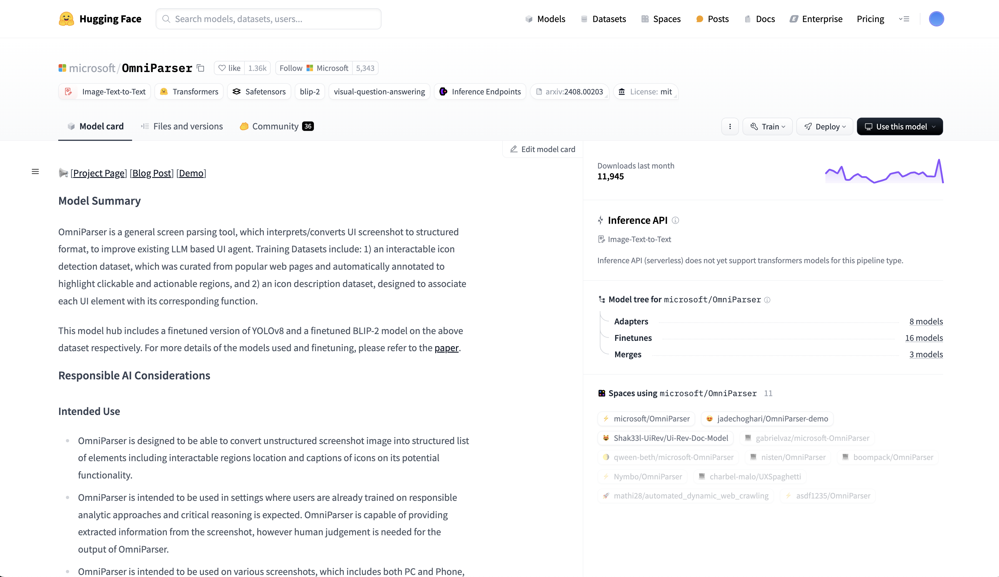
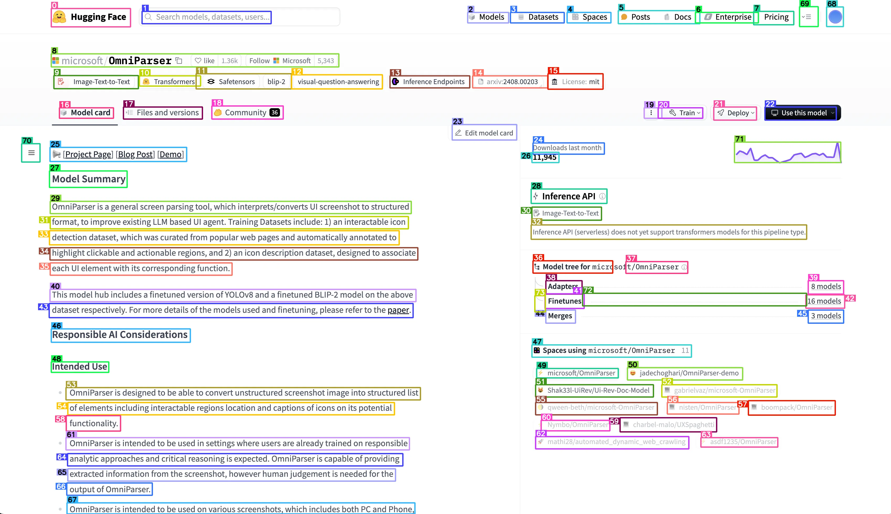

# OmniParser API

Self-hosted version of Microsoft's [OmniParser](https://huggingface.co/microsoft/OmniParser) Image-to-text model.

> OmniParser is a general screen parsing tool, which interprets/converts UI screenshot to structured format, to improve existing LLM based UI agent. Training Datasets include: 1) an interactable icon detection dataset, which was curated from popular web pages and automatically annotated to highlight clickable and actionable regions, and 2) an icon description dataset, designed to associate each UI element with its corresponding function.

## Why?

There's already a great HuggingFace gradio [app](https://huggingface.co/spaces/microsoft/OmniParser) for this model. It even offers an API. But

- Gradio is much slower than serving the model directly (like we do here)
- HF is rate-limited

## How it works

If you look at the Dockerfile, we start off with the HF demo image to retrive all the weights and util functions. Then we add a simple FastAPI server (under main.py) to serve the model.

## Getting Started

### Requirements

- GPU
- 16 GB Ram (swap recommended)

### Locally

1. Clone the repository
2. Build the docker image: `docker build -t omni-parser-app .`
3. Run the docker container: `docker run -p 7860:7860 omni-parser-app`

### Self-hosted API

I suggest hosting on [fly.io](https://fly.io) because it's quick and simple to deploy with a CLI.

This repo is ready-made for deployment on fly.io (see fly.toml for configuration). Just run `fly launch` and follow the prompts.

## Docs

Visit `http://localhost:7860/docs` for the API documentation. There's only one route `/process_image` which returns

- The image with bounding boxes drawn on (in base64) format
- The parsed elements in a list with text descriptions
- The bounding box coordinates of the parsed elements

## Examples

| Before Image                       | After Image                   |
| ---------------------------------- | ----------------------------- |
|  |  |

## Related Projects

Check out [OneQuery](https://query-rho.vercel.app), an agent that browses the web and returns structured responses for any query, simple or complex. OneQuery is built using OmniParser to enhance its capabilities.

apt update && apt upgrade -y
apt install git-lfs -y
apt install ncdu -y

cudnn_version=8.6.0.163
cuda_version=cuda11.8
apt-get install libcudnn8=${cudnn_version}-1+${cuda_version} \
                libcudnn8-dev=${cudnn_version}-1+${cuda_version}

git clone --depth 1 https://huggingface.co/microsoft/OmniParser
mv OmniParser/icon_detect omniparser-api/weights/icon_detect
mv OmniParser/icon_caption_florence omniparser-api/weights/icon_caption_florence
rm -rf OmniParser/.git OmniParser/icon_detect_v1_5

git clone https://github.com/davidfant/omniparser-api
cd omniparser-api/
python3 -m venv venv
venv/bin/python3 -m pip install -r requirements.txt
venv/bin/python3 -m pip uninstall pandas
venv/bin/python3 -m pip install pandas
mkdir imgs
venv/bin/python3 weights/convert_safetensor_to_pt.py

pkill jupyter
nohup venv/bin/python3 -m uvicorn main:app --host 0.0.0.0 --port 8888 > nohup.output &
